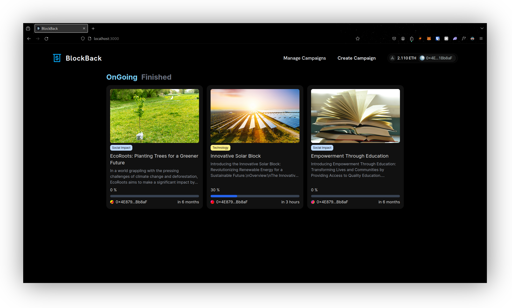
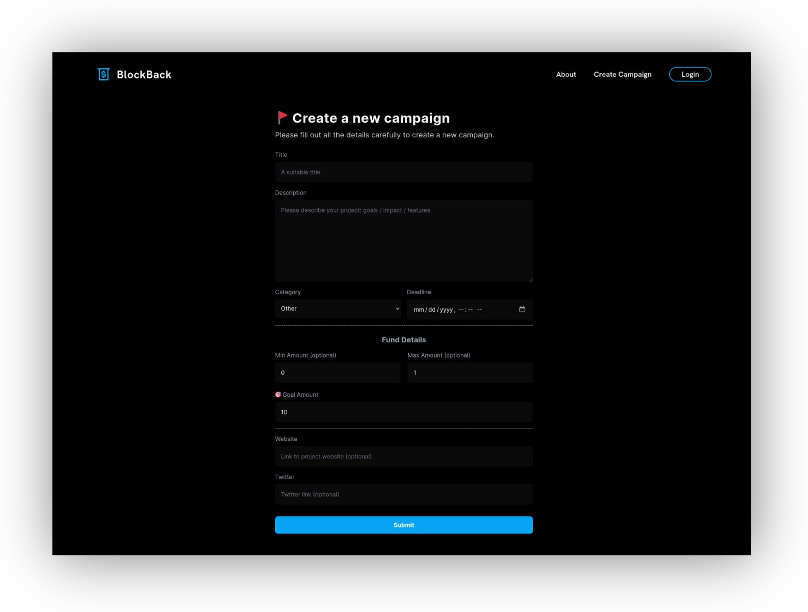
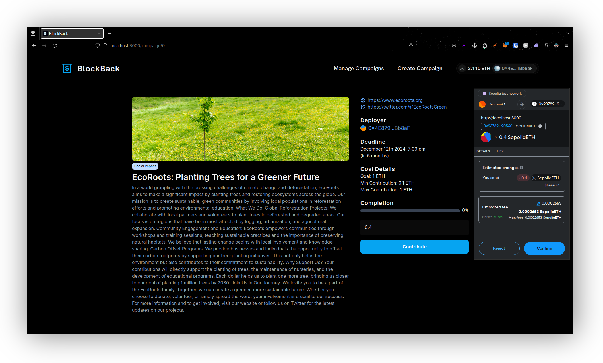

# BlockBack
BlockBack is a web application built with NextJS and [wagmi.sh](https://wagmi.sh), along with a smart contract on the Ethereum blockchain. It lets users create, manage, and donate to campaigns easily.

Deployment: https://blockback.alk.pw/<br>
Contract Deployed on `0x9378925B432071214982D5ee1a03C1C520090560` on Sepolia <br>
[Sepolia Etherscan](https://sepolia.etherscan.io/address/0x9378925B432071214982D5ee1a03C1C520090560)


## Features
- Create Campaigns: Start new campaigns effortlessly.
- Donate to Campaigns: Donate to any active campaign.
- List Campaigns by Completion State: View campaigns based on their progress.
- Manage Campaigns: Control your created campaigns, including withdrawing funds.


### Campaign Metadata Storage
BlockBack uses a backend written in Deno Oak to handle campaign metadata. This includes images, text, links, and other details. By saving this information off-chain, we keep the blockchain transactions efficient and cost-effective.

```bash
Create Campaign:
User -> Backend Server (Save Metadata) -> Server (Generate Hash) -> Blockchain (Save Hash)

Retrieve Campaign:
User -> Blockchain (Fetch Hash) -> Backend Server (Fetch Metadata) -> Display Campaign
```

> [!NOTE]
> This is just the basic implementation of the idea, which I created to learn Solidity concepts. The website is not fully complete, and there might be bugs in some areas.

## Screenshots


